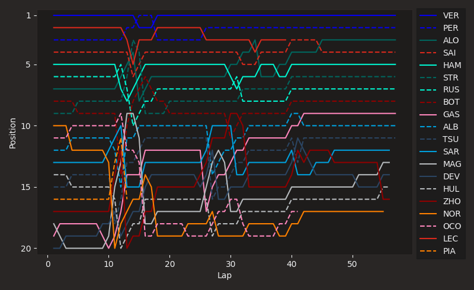
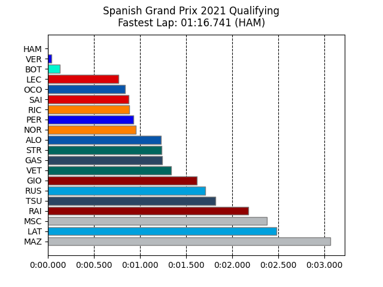
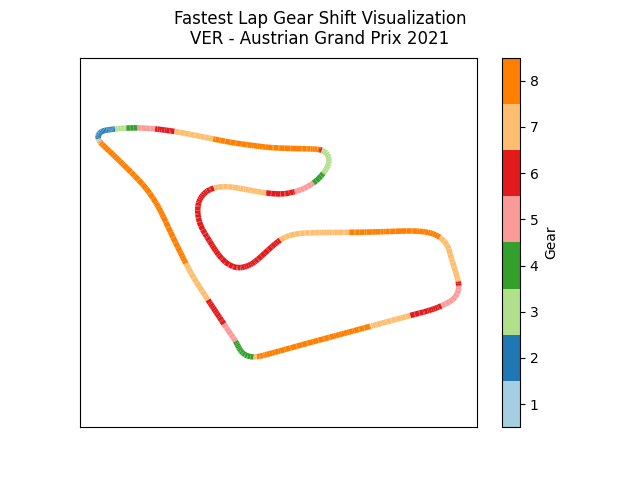
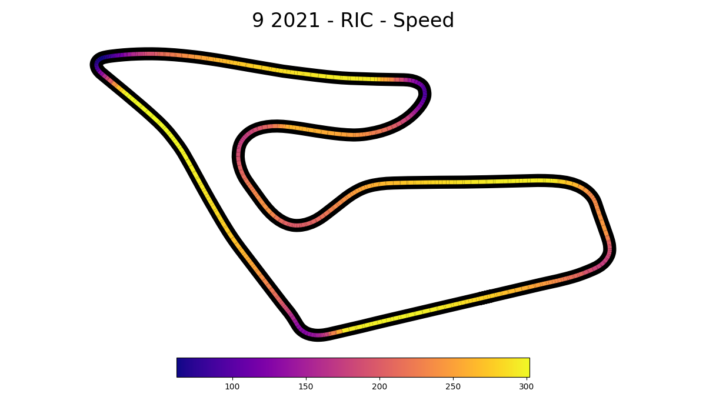

<h1 align="center">

</h1>

# Traktor

Traktor is a discord bot developed in python that uses the [Fastf1](https://docs.fastf1.dev/) package to deliver the latest and past seasons data in discord.

## Commands
* 🏎️ **Balls** 🏎️: Balls
* 🏎️ **Printer** 🏎️: Basic command to make the bot say anything
* 🏎️ **Drivers** 🏎️: Show driver standings by year
* 🏎️ **Driverinfo** 🏎️: Show driver info for a specific GP session on a certain year
* 🏎️ **Constructors** 🏎️: Show constructor standings by year
* 🏎️ **Gpinfo**🏎️: Show detailed info for a specific Grand Prix a specific year
* 🏎️ **Gpresults** 🏎️: Show session results for a specific Grand Prix a certain year
* 🏎️ **Seasonschedule**🏎️: Gets the schedule of a specific GP
* 🏎️ **Calendar**🏎️ : Gets the GP left this season
* 🏎️ **Positionchanges**🏎️ : Shows an image of the position changes of the race
* 🏎️ **Trackspeed**🏎️ : Shows an image of a specific driver in a session
* 🏎️ **Qualifyingresults**🏎️: Shows an image with the gap between each driver in qualy
* 🏎️ **Cornergraph**🏎️: Shows an image of the different corners in a certain Grand Prix
*  🏎️ **Simplylovely**🏎️: Simply Lovely!


## How to Run
### Docker (Recommended)
1- Run ``` docker build -t traktor-app . ``` to build the image, you can rename the image by replacing the `traktor-app` which is the default name

2- Run the image built in previous step with ```docker run -d --rm --name traktor traktor-app``` and start using!

3- To stop the container use ``` docker stop traktor ```

### Locally
In **vscode** by pressing the ```play``` button should work, if it fails, you can also Execute ``` python -m main.py ``` inside the project in your terminal and it will work perfectly fine.

## Images
All images are generated with the [fast f1 examples galery](https://docs.fastf1.dev/gen_modules/examples_gallery/index.html)

### Examples

<table>
  <tr>
    <td align="center"><b>Corners</b></td>
    <td align="center"><b>Positions</b></td>
  </tr>
  <tr>
    <td></td>
    <td></td>
  </tr>
  <tr>
    <td align="center"><b>Qualy Results</b></td>
    <td align="center"><b>Shifts</b></td>
  </tr>
  <tr>
    <td></td>
    <td></td>
  </tr>
  <tr>
    <td align="center"><b>Speeds</b></td>
    <td></td>
  </tr>
  <tr>
    <td></td>
    <td></td>
  </tr>
</table>
